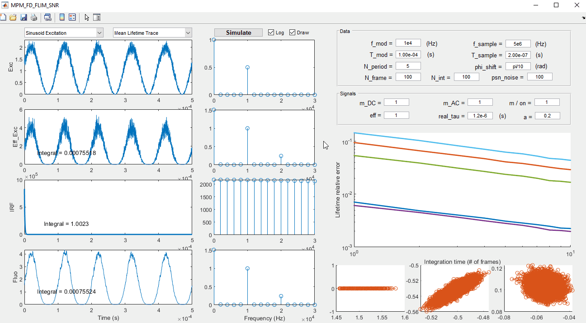

# MPM-FD-FLIM-SNR
This is the repository of a Matlab GUI program that simulates the lifetime measurement process of a multiphoton frequency-domain fluorescence lifetime imaging microscopy (MPM-FD-FLIM). The program can also investigate the signal-to-noise ratio (SNR) performance of the lifetime measurements. More details can be found in the following publication:

- [Y. Zhang, A. A. Khan, G. D. Vigil, and S. S. Howard, “Investigation of signal-to-noise ratio in frequency-domain multiphoton fluorescence lifetime imaging microscopy,” J. Opt. Soc. Am. A, vol. 33, no. 7, p. B1, Jul. 2016.](https://www.osapublishing.org/josaa/abstract.cfm?uri=josaa-33-7-B1)
```latex
@article{Zhang2016,
  author = {Zhang, Yide and Khan, Aamir A. and Vigil, Genevieve D. and Howard, Scott S.},
  doi = {10.1364/JOSAA.33.0000B1},
  journal = {Journal of the Optical Society of America A},
  month = {jul},
  number = {7},
  pages = {B1},
  title = {{Investigation of signal-to-noise ratio in frequency-domain multiphoton fluorescence lifetime imaging microscopy}},
  url = {https://www.osapublishing.org/abstract.cfm?URI=josaa-33-7-B1},
  volume = {33},
  year = {2016}
}
```

## Installation
- Install [Matlab](https://www.mathworks.com/products/matlab.html) on your computer
- Clone this repository:
```
git clone https://github.com/yzhang34/MPM-FD-FLIM-SNR.git
```
- Run the file 'MPM_FD_FLIM_SNR.m' with Matlab

## Example


## License & Copyright
© 2019 Yide Zhang, University of Notre Dame

Licensed under the [Apache License 2.0](LICENSE)